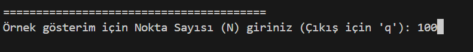
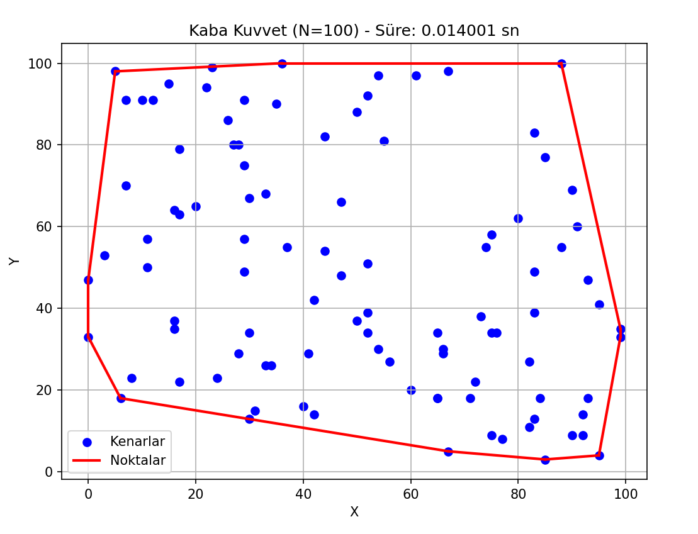
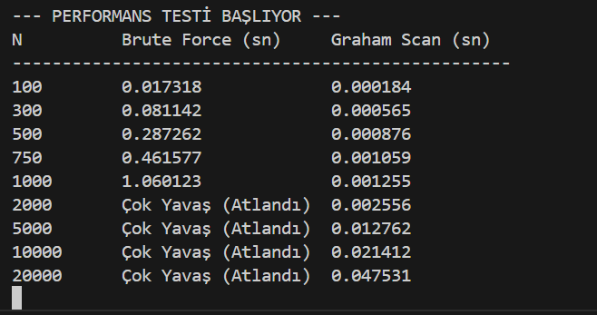

#  Convex Hull (Kapalı Çevrim) Analizi  
## Brute Force ve Graham Scan Algoritmalarının Karşılaştırılması

Bu proje, **Algoritma Analizi ve Tasarımı** dersi kapsamında geliştirilmiştir.  
Amaç, **Kapalı Çevrim (Convex Hull)** problemini farklı algoritmalar kullanarak çözmek ve  
**teorik hesaplama karmaşıklıkları ile pratik performans sonuçlarını karşılaştırmaktır.**

---

## Problem Tanımı

Kapalı çevrim (convex hull), düzlemde verilen bir nokta kümesini tamamen içine alan  
**en küçük dışbükey çokgendir**.

Bu projede:
- Rastgele noktalar üretilmiştir
- Convex hull, **Brute Force** ve **Graham Scan** algoritmalarıyla hesaplanmıştır
- Algoritmaların **çalışma süreleri ölçülmüş**
- Sonuçlar **grafiksel olarak karşılaştırılmıştır**

---

## Kullanılan Algoritmalar

###  1. Brute Force (Kaba Kuvvet) Algoritması
- Tüm nokta çiftleri potansiyel kenar olarak değerlendirilir
- Her kenar için, diğer tüm noktaların aynı tarafta olup olmadığı kontrol edilir
- Hesaplama maliyeti oldukça yüksektir

**Teorik Karmaşıklık:**  
- `O(N³)`

---

###  2. Graham Scan Algoritması
- En alt–en sol nokta başlangıç noktası olarak seçilir
- Diğer noktalar polar açıya göre sıralanır
- Stack (yığın) yapısı kullanılarak dışbükey sınır oluşturulur

**Teorik Karmaşıklık:**  
- `O(N log N)`  

---

## Uygulama Arayüzü ve Çıktılar

### Rastgele Nokta Üretimi
Algoritma, girilen değer kadar nokta üretir. Aşağıda bu değer 100 olarak girilmiştir :

---

### Brute Force Convex Hull Sonucu

Brute Force algoritması kullanılarak elde edilen kapalı çevrim sonucu:

---

### Graham Scan Convex Hull Sonucu

Graham Scan algoritması ile hesaplanan kapalı çevrim sonucu:

---

## Performans Testi ve Grafiksel Karşılaştırma

Algoritmalar farklı nokta sayıları için test edilmiştir.

- **X Ekseni:** Nokta Sayısı (N)
- **Y Ekseni:** Çalışma Süresi (saniye)

### Gözlemler
- Brute Force algoritması, nokta sayısı arttıkça çok hızlı şekilde yavaşlamaktadır
- Graham Scan algoritması, teorik beklentiye uygun olarak daha dengeli bir artış göstermektedir
- Büyük veri kümelerinde Graham Scan açık ara daha verimlidir

---
